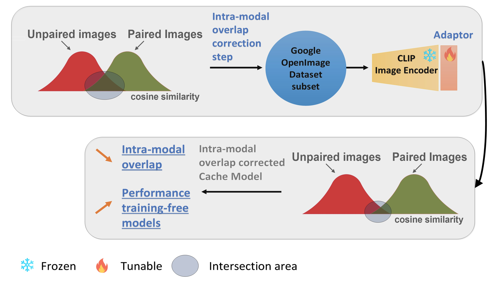

Official implementation of [CLIP Adaptation by Intra-modal Overlap Correction](https://arxiv.org/abs/2409.11338)

The paper has been accepted by BMVC 2024 (Oral). 

# Introduction

Numerous methods have been proposed to adapt a pre-trained foundational CLIP
model for few-shot classification. As CLIP is trained on a large corpus, it generalises well
through adaptation to few-shot classification. In this work, we analyse the intra-modal
overlap in image space in terms of embedding representation. Our analysis shows that,
due to contrastive learning, embeddings from CLIP model exhibit high cosine similarity
distribution overlap in the image space between paired and unpaired examples affecting
the performance of few-shot training-free classification methods which rely on similarity
in the image space for their predictions. To tackle intra-modal overlap we propose to
train a lightweight adapter on a generic set of samples from the Google Open Images
dataset demonstrating that this improves accuracy for few-shot training-free classification. 
We validate our contribution through extensive empirical analysis and demonstrate
that reducing the intra-modal overlap leads to a) improved performance on a number
of standard datasets, b) increased robustness to distribution shift and c) higher feature
variance rendering the features more discriminative for downstream tasks.

# Installation
This repository requires the installation the environment and datasets:

* follow https://github.com/KaiyangZhou/Dassl.pytorch#installation to install Dassl.pytorch
* follow DATASETS.md to install the datasets.
* install package requirements in requirements.txt

# Adapter Training

We will release our trained checkpoints soon. To train your own please run:

### Supervised training

For the supervised training run the following code: 

`CUDA_VISIBLE_DEVICES=0 python3 supervised_train.py --attempt 1`

### Unsupervised training
For the unsupervised training run the following code:

`CUDA_VISIBLE_DEVICES=1,2,3 torchrun --standalone --nproc_per_node=3 dino_clip_training.py --output_dir /model-output-dir \
--data_root /data-dir --epochs 10 --distributed --batch_size 40 --momentum_teacher 0.9998 \
--adapter_train --freeze_last_layer 0 --lr 0.0008 --oi_root /open-images-dir \
--images_path /images-ids-csv --warmup_epochs 2 --warmup_teacher_temp_epochs 3`

We trained these adapters on NVIDIA GPU RTX 3090 24GB. 

# Running

Once the Adapter on CLIP model has been trained, run the following code to get the few-shot results:

`CUDA_VISIBLE_DEVICES=1 sh search_params.sh folder_id seed models_checkpoint/path-to-model/model.pt 10`

Run for seed=1,2,3

## Acknowledgement
For this work we borrowed some code from these repos: [CLIP](https://github.com/openai/CLIP), [Tip-Adapter](https://github.com/gaopengcuhk/Tip-Adapter), [SuS-X](https://github.com/vishaal27/SuS-X) and [DINO](https://github.com/facebookresearch/dino). Thanks a lot to the authors!